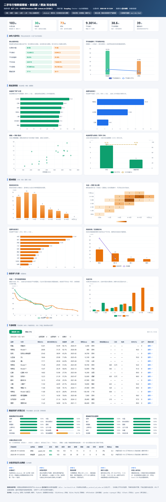

# 二手车行情采集平台（usedcar-crawler）

基于 [Scrapling](https://github.com/D4Vinci/Scrapling) 构建的二手车数据采集全链路项目：
**采集 → 解析 → 清洗 → 校验 → 去重 → 入库 → 导出 → 可视化 → 调度**，按 **新能源（EV）** 与
**燃油（FUEL）** 两条业务线独立建模。

> **数据真实性与合规是本项目的硬约束**：全部数据来自瓜子二手车在 `robots.txt` 中
> **显式放行**的车源详情 `.md` 通道（`Allow: /car-detail/*.md` + `Allow: /*.md$`），
> 配套 `Sitemap` 索引约 14 万条车源 URL。**没有任何一条模拟/伪造数据进入交付。**

- 实测环境：Python 3.13 / Scrapling 0.4.15 / SQLite（开发）· MySQL 8（生产）
- 测试：**229 个用例全部通过**（含本地 HTTP 真实取数的集成测试），另有 `selftest` 离线全链路自检
- 已入库真实数据：**103 条车源**（新能源 30 / 燃油 73，覆盖 45 个品牌、39 个城市）
- 可视化：`dashboard/index.html` 单文件看板，**离线双击即开**（ECharts 已本地化）



---

## 1. 快速开始

```bash
# 1) 环境
python -m venv .venv
.venv\Scripts\activate                 # Windows（Linux/macOS: source .venv/bin/activate）
pip install -r requirements.txt
pip install -e .                        # 让 python -m usedcar_crawler 可用
scrapling install                       # 仅 stealth/dynamic 档位需要浏览器，可跳过

# 2) 配置
copy .env.example .env

# 3) 离线自检：不需要网络，验证解析/清洗/校验/去重/幂等入库/导出全链路
python -m usedcar_crawler selftest

# 4) 合规巡检（先确认能不能抓）
python -m usedcar_crawler compliance --verify

# 5) 真实采集：站点地图 -> 逐条详情页
python -m usedcar_crawler crawl --line all --maps 2 --sample 20      # 先小步验证
python -m usedcar_crawler crawl --line all --maps 8 --sample 40      # 再放量

# 6) raw 层回放：不联网，把已落盘原始响应重新解析入库（解析口径修好后重算全量）
python -m usedcar_crawler replay --line all

# 7) 看板：单文件 HTML，双击即开，无需联网
python -m usedcar_crawler viz

# 8) 查询、导出、日志
python -m usedcar_crawler stats --line all --summary
python -m usedcar_crawler export --line ev --format both
python -m usedcar_crawler logs --limit 20

# 9) 溯源对账：用独立正则复核"库内值 = 原始页面值"（退出码非 0 即存在不一致）
python tools/verify_against_raw.py

# 10) 常驻调度 / 测试
python -m usedcar_crawler schedule
pytest -q
```

零网络体验：`run --line all --pages 1 --fixture` 会走仓库内的**离线测试夹具**
（仅用于 CI 自检，**不参与交付数据**）。

**给面试官看的三样东西**：

| 想看什么 | 打开哪里 |
|---|---|
| 数据长什么样、能不能直接用 | `dashboard/index.html`（双击打开，11 张图表 + 可筛选明细表 + 数据质量面板） |
| 非技术版项目说明 | `面试官演示说明.md` |
| 技术验收结论（计划书逐项核对 / 耗时 / 数据质量 / 问题分级） | `docs/验收测试报告.md` |
| 项目计划书（目标 / 里程碑 / 验收口径） | `docs/project-plan.md` |
| 第三方评审报告（测试主管视角，含分级改进项与复现方式） | `docs/code-review-report.md` |

---

## 2. 架构

```
                ┌──────────────── scheduler（APScheduler）────────────────┐
                │  daily_incr / weekly_full / retry（cron 由配置驱动）      │
                └───────────────────────────┬────────────────────────────┘
                                            │ TaskSpec(line, sources, maps, sample)
      ┌─────────────────────────────────────▼─────────────────────────────────────┐
      │ sources/registry   配置驱动源注册表（启用状态 + robots 合规档案 + 选择器）      │
      └─────────────────────────────────────┬─────────────────────────────────────┘
                                            │
   ┌────────────────── 列表页路径 runner.py ─┐   ┌──── 详情页路径 detail_runner.py ────┐
   │ 一次拿几十条卡片，品牌车型靠标题猜        │   │ 站点地图 -> 逐条详情页，字段结构化     │
   │ 失败模式：站点改版导致选择器失效          │   │ 失败模式：频率限制（HTTP 200 假页）    │
   └────────────────────────┬───────────────┘   └────────────────┬──────────────────┘
                            └──────────────┬─────────────────────┘
      ┌─────────────────────────────────────▼─────────────────────────────────────┐
      │ fetcher/  取数层                                                           │
      │  ① 合规闸门 robots.txt（一票否决）  ② 令牌桶限速（按源独立 QPS）              │
      │  ③ 三档阶梯 http → stealth → dynamic（拦截/JS 空壳自动升档）                 │
      │  ④ 指数退避重试  ⑤ 状态码闸门  ⑥ 原始快照落盘留证                            │
      │  ⑦ 内容契约校验（HTTP 200 ≠ 拿到数据，风控页必须被识别）                      │
      │  ⑧ 风控冷却 + 熔断 + 断点续爬                                               │
      └─────────────────────────────────────┬─────────────────────────────────────┘
                                            │ raw 响应 + snapshot（data/raw · data/captured）
      ┌─────────────────────────────────────▼─────────────────────────────────────┐
      │ parsers/  解析层（Scrapling Selector）                                      │
      │  guazi_md（详情页结构化字段）· ev / fuel（列表页选择器组）                     │
      └─────────────────────────────────────┬─────────────────────────────────────┘
                                            │ dict（保留 *_raw 原始文案）
      ┌─────────────────────────────────────▼─────────────────────────────────────┐
      │ pipeline/  加工层  cleaners 标准化 → models 校验 → dedupe 指纹 → exporter   │
      │                    detail_runner 编排（含 raw 层回放 replay）                │
      └─────────────────────────────────────┬─────────────────────────────────────┘
                                            │
      ┌─────────────────────────────────────▼─────────────────────────────────────┐
      │ storage/  SQLAlchemy Core（SQLite / MySQL 双兼容）                          │
      │  ev_vehicles · fuel_vehicles · crawl_log · 唯一键 UPSERT · 下架追踪          │
      └──────────────────────────────┬────────────────────────────────────────────┘
                                     │
      ┌──────────────────────────────▼────────────────────────────────────────────┐
      │ viz.py  看板：后端算聚合，前端只渲染；单文件 HTML + 本地 ECharts，离线可用      │
      └───────────────────────────────────────────────────────────────────────────┘
```

### 目录结构

```
usedcar-crawler/
├── config/
│   ├── settings.yaml         # 限速/重试/存储/导出/调度（环境变量可覆盖）
│   └── sites.yaml            # 站点、选择器、启用状态、robots 合规档案
├── dashboard/
│   ├── index.html            # 行情看板（viz 生成，单文件）
│   └── echarts.min.js        # 本地化图表库，保证离线演示
├── data/
│   ├── usedcar.db            # SQLite 开发库（DWD 干净表）
│   ├── captured/guazi_md/    # raw 层：真实车源详情响应（回放与取证）
│   └── checkpoints/          # 断点续爬进度
├── docs/
│   ├── DATA_SOURCE.md        # 数据源合规审计（robots 证据 / 反爬实测 / 红线）
│   ├── architecture.md       # 架构 + ADR 设计决策 + Scrapling 实测踩坑
│   ├── data-dictionary.md    # 字段口径、更新频率、异常规则、SQL 示例
│   └── runbook.md            # 部署、巡检、排障、改版应急 SOP、合规红线
├── src/usedcar_crawler/
│   ├── cli.py                # run / crawl / replay / viz / probe / export / stats / logs / compliance / selftest / schedule
│   ├── config.py             # YAML + 环境变量三级配置
│   ├── fetcher.py            # Scrapling 封装：闸门 / 三档降级 / 重试 / 快照 / 单档 fetch_once
│   ├── parser 层              # parsers/  base + guazi_md（详情页）+ ev/fuel（列表页）
│   ├── pipeline/
│   │   ├── detail_runner.py  # 详情页编排：发现 / 采集 / 冷却熔断 / 断点续爬 / 回放
│   │   ├── cleaners.py       # 字段标准化（价格 / 里程 / 年份 / 续航 / 品牌归一）
│   │   └── exporter.py       # Excel / CSV 导出
│   ├── sources/
│   │   ├── registry.py       # 源配置模型与校验（含 sitemap 模式）
│   │   └── sitemap.py        # 站点地图解析 / 索引下钻 / 等距抽样
│   ├── viz.py                # 看板聚合与渲染
│   └── storage/repository.py # UPSERT / 统计 / 日志
└── tests/                    # 229 例，全部离线可跑
```

---

## 3. 两条业务线

| 维度 | 新能源（EV） | 燃油（FUEL） |
|---|---|---|
| 估值主线 | 电池健康度（SOH）、续航口径、电池类型 | 车龄、里程、排量、变速箱工况 |
| 专属字段 | `battery_type` `range_km` `range_standard` `battery_health` `fast_charge_kw` | `displacement_l` `gearbox` `emission_standard` |
| 表 | `ev_vehicles` | `fuel_vehicles` |
| 数据源 | 见 §5：瓜子 `.md` 详情通道（**同一通道同时供给两条线**，由 `energy.type` 分流） |

两条线**表结构与解析器完全独立**，仅在限速、重试、去重、导出、日志等纯技术基建上复用。

### 3.1 一个必须讲清的数据口径（EV 红线）

瓜子的详情页会把「CLTC 综合续航 1625km」写进文案。对**增程 / 插混**车型，
这是"满油满电"的总里程，**不是纯电续航**。若直接入库，就会与纯电车的 CLTC 续航
混在同一张散点图上，得出"续航越长越贵"的完全错误结论。

因此解析器对增程/插混车**只接受明确标注「纯电续航」的数字**，拿不到就如实留空——
**缺失是可解释的，错误值是会误导决策的**。这条规则由 `tests/test_guazi_md.py::TestRangeParsing`
锁定，且兼容两种语序（`续航605公里` 与 `610km续航`）。

---

## 4. 数据质量与可观测性（不只是"能抓到"）

| 机制 | 实现 | 解决的问题 |
|---|---|---|
| 内容契约校验 | HTTP 200 后仍校验响应结构（`looks_like_detail_md`） | 风控页伪装 200 混进统计，静默推高缺失率 |
| 脏数据拒收 | Pydantic 模型硬校验（`price_wan` 缺失即丢弃，绝不写 0） | "面议/暂无"混进统计 |
| 单位标准化 | 正则统一为万元 / 公里 / 年月，保留续航口径 | 少个零、万元与元混用 |
| 指纹去重 | `MD5(平台 + 车源ID)` 唯一键 UPSERT | 重复抓取导致数据翻倍 |
| 跨源归并 | `match_key`（品牌+车型+年款+月份+里程分段） | 同一台车在多平台无法比价 |
| 下架追踪 | `last_seen_at` + `missing_count` → `is_deleted` | 库存在售状态失真 |
| 改版感知 | 必需字段缺失率 > 30% → 告警 + 状态 partial | 从"业务方发现没数据"提前到主动告警 |
| 数据溯源 | 原始响应落盘（`raw_ref` 指回具体文件） | 解析规则出错时无法界定影响范围 |
| 运行留痕 | `crawl_log` 表 + `trace_id` 结构化日志 | 无法回答"上次成功是什么时候" |
| 自助交付 | 导出 Excel 附带「字段说明」sheet + 一页纸摘要 | 业务方反复来问字段含义 |

**本次交付的实测质量**（`replay` 回放 103 条真实车源）：

```
业务线  来源      状态     raw文件  解析  入库(新/更)  去重  缺失率
ev      guazi_md  success  103      30    30/0         0     0.0%
fuel    guazi_md  success  103      73    73/0         0     0.0%
```

核心字段（价格 / 品牌 / 里程 / 新车指导价 / 保值率 / 城市）**100% 覆盖**；
EV 的续航、电池类型等派生字段按源披露情况留空（不猜测、不填充）。

---

## 5. 合规：实测核查结论

| 站点 | robots.txt 实测 | 处置 |
|---|---|---|
| **瓜子二手车**（guazi.com） | `Allow: /`；**显式 `Allow: /car-detail/*.md` 与 `Allow: /*.md$`**；`Sitemap` 指向 `pc_cardetail_md_index.xml` | **采用**：只走这条显式放行的 `.md` 通道，URL 不含查询参数 |
| 瓜子 HTML 列表页 | `Allow: /`，但 `Disallow: /*?*`，且 HTML 通道抗性较强 | 暂不采用（保留档案，改用 `.md` 通道） |
| 懂车帝（dongchedi.com） | `User-Agent: * → Disallow: /`（**全站禁止**） | `enabled: false`，保留档案作为审计痕迹 |
| 汽车之家二手车（che168.com） | `User-Agent: * → Disallow: /`（**全站禁止**） | 同上 |
| 电动邦（diandong.com） | robots.txt 返回 404（未声明规则） | 未校准选择器，暂不启用 |

**三重防线**：① `config/sites.yaml` 固化核查结论（可评审、可审计）→ ② 编排层启动即拦截
（判定禁止的源连请求都不发）→ ③ `RobotsGate` 每次请求前联网复核（结论不会过期）。

```
$ usedcar-crawler compliance
来源                业务线  启用  档案状态    实时核查  结论
--------------------------------------------------------------
diandong_ev         ev      否    unknown     skipped   已禁用
dongchedi_ev        ev      否    disallowed  skipped   已禁用
guazi_md            both    是    allowed     skipped   待核查
local_fixture_ev    ev      是    unknown     skipped   待核查
autohome_fuel       fuel    否    disallowed  skipped   已禁用
guazi_fuel          fuel    否    allowed     skipped   已禁用
local_fixture_fuel  fuel    是    unknown     skipped   待核查
```

### 5.1 频率限制的实测与应对（本项目最真实的一次踩坑）

采集过程中实测到：`/car-detail/*.md` 通道在请求密度升高后**开始以 HTTP 200 返回
站点的 SPA 空壳页**（不是 403、不是验证码，就是正常状态的空壳）。

| 观测 | 结论 |
|---|---|
| 空壳页 `Content-Type: text/html`、长度恒定、所有 URL 返回同一份 | 不是单条数据问题，是**通道级风控** |
| 站点地图（`*.xml`）始终正常返回，仅详情通道受限 | 限制作用在**内容路径**而非整站 |
| 换 UA（含 GPTBot/ClaudeBot 等白名单爬虫）、换真实浏览器指纹，结果不变 | 判定依据是**出口 IP 信誉**，不是指纹 |
| 查询参数变体、其他站点端点同样返回空壳 | 属**出口 IP 级**软封禁 |

**应对（已落地在代码里，不是文档口号）**：

1. **内容契约校验**：`looks_like_detail_md` 把空壳页判为"被拦截"，绝不静默计入缺失率；
2. **冷却 + 熔断**：命中风控就等（默认 150s，可调），等够上限即收手，**不硬刚**；
3. **断点续爬**：每条成功即落 `data/checkpoints/*.urls`，中断不丢进度；
4. **raw 层回放**：`replay` 让解析链与采集链解耦，**采集环境受限时依然能完成入库与看板**。

> 面试话术锚点：**爬虫工程师的价值不是突破封锁，而是稳定、合规、低成本地拿到干净数据；
> 拿不到时，如实记账并让链路优雅降级，而不是用假数据把报表填满。**

---

## 6. Scrapling 实测：哪些能力用了，哪些**没有**用

### 已落地并验证

| 能力 | 用法 |
|---|---|
| HTTP 取数 | `Fetcher.get(url, stealthy_headers=True, follow_redirects=True)` |
| 隐身 / 动态渲染 | `StealthyFetcher.fetch(...)` / `DynamicFetcher.fetch(...)`（拦截或 JS 空壳时升档） |
| 离线解析 | `Selector(html, url=...)` —— 夹具与快照回放都靠它，CI 完全不需要网络 |
| 选择器体系 | CSS + `::text` / `::attr()` + `find_all` / `find_by_text` 等 |
| 指纹保存 | `.css(sel, auto_save=True)` |

### 实测未达预期，因此**不作为依赖**

`adaptive=True` 的自动重定位：把 `class="car-item"` 改成 `car-card-v2` 后实测
——普通选择器 0 命中，`adaptive=True` 同样 0 命中；显式配置 `SQLiteStorageSystem` 后仍为 0
（`auto_save` 本身正常，能保存 4 个元素指纹）。

**所以本项目不宣称"改版自愈"，改用可验证的抗改版三道防线**：
① 选择器全部配置化（改版只改 YAML，不改代码）→ ② 必需字段缺失率监控 + 告警 →
③ 原始快照落盘可回放（重构解析规则时不用重新抓取）。

### 其他实测踩坑（已在代码中修正并写入测试）

| 现象 | 影响 | 修正 |
|---|---|---|
| `Fetcher` 只有 `.get()`，浏览器档位才用 `.fetch()` | 统一调用会直接崩 | 按档位分派入口方法 |
| `element.text` 只返回节点自身文本（`<em>15.98</em>万` 只得到 `"万"`） | 价格解析全线失败 | 含子节点时改用 `get_all_text()` |
| 4xx/5xx **不抛异常**，直接返回 Response | 404 页面被当成功数据入库 | 增加状态码闸门 `ensure_status_ok` |
| 详情页续航空壳（风控页）也是 200 | 空壳页被当"解析不到字段的合法页面" | 内容契约校验 + 冷却重试 |

---

## 7. 工程规范落点

| 要求 | 落点 |
|---|---|
| 目录结构 | `src/` 布局 + 分层包（parsers / pipeline / sources / storage） |
| 编码风格 | 全量类型注解、`from __future__ import annotations`、单一职责、纯函数化的标准化逻辑 |
| 日志 | 结构化日志 + `trace_id` 贯穿任务 + 可选 JSON Lines + 按天切割与自动清理 |
| 异常处理 | 分级异常体系（`retryable` 决定重试；`RobotsDenied` 一票否决；单条失败不拖垮整批） |
| 配置管理 | YAML → `.env` → 环境变量三级覆盖；站点与选择器全配置化；密钥只走环境变量 |
| 单元测试 | 229 例，全部离线可跑（注入假 Transport），另有本地 HTTP 集成测试 |
| 文档 | README + 数据源审计 + 架构/ADR + 数据字典 + 运维手册 |

---

## 8. 后续迭代

| 优先级 | 事项 | 理由 |
|---|---|---|
| P0 | 接入代理池（`fetcher` 已预留出口配置点） | 出口 IP 被限流时的正规解法，避免硬刚风控 |
| P0 | 改版/失败告警接入企微或飞书（`notify` 已就绪，填 webhook 即可） | 把被动发现变为主动感知 |
| P1 | 迁移到 `scrapling.spiders.Spider` 并发框架 | 源数量增长后串行成为瓶颈 |
| P1 | Redis 去重集合 + 分布式调度 + 分布式断点续爬 | 多机部署时的任务互斥与进度共享 |
| P1 | 历史价格拉链表 | 支撑"降价跟踪"这一二手车核心业务指标 |
| P2 | 车型库改为数据表驱动（现为常量表） | 品牌/车型别名需要运营维护 |
| P2 | 补充可合规采集的数据源，替换已禁站点 | 保证两条业务线都有稳定的真实数据供给 |

---

## 9. 合规声明

本项目仅采集公开可访问信息，启动前强制校验目标站点的 `robots.txt`，
**只采集 robots.txt 显式放行的通道**，按源独立限速，不登录、不绕过验证码、
不采集任何个人身份信息，数据仅用于本项目声明的分析用途。
**已在配置中排除所有 robots.txt 禁止抓取的站点。**
